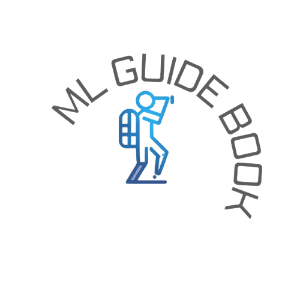

====================================================
The amateur's guide to explore machine learning
====================================================

  

Welcome.

I created this documentation as my exploration of **machine learning & data science**.

I usually forget logics, methods, algorithms and code. Hence to keep everything at one place so that I can go through the topic quickly as referenced. 

Source of the content mostly from a free course, video, research paper and book (most of the references are mentioned with the topic).

**If I haven't mentioned your reference correctly then let me know, I'll add it asap.**

+-----------+--------------------------------------------+
| email     | nishantbaheti.it19@gmail.com               |
+-----------+--------------------------------------------+
| github    | https://www.github.com/nishantbaheti       |
+-----------+--------------------------------------------+
| linkedin  | https://www.linkedin.com/in/nishantbaheti/ |
+-----------+--------------------------------------------+
    

