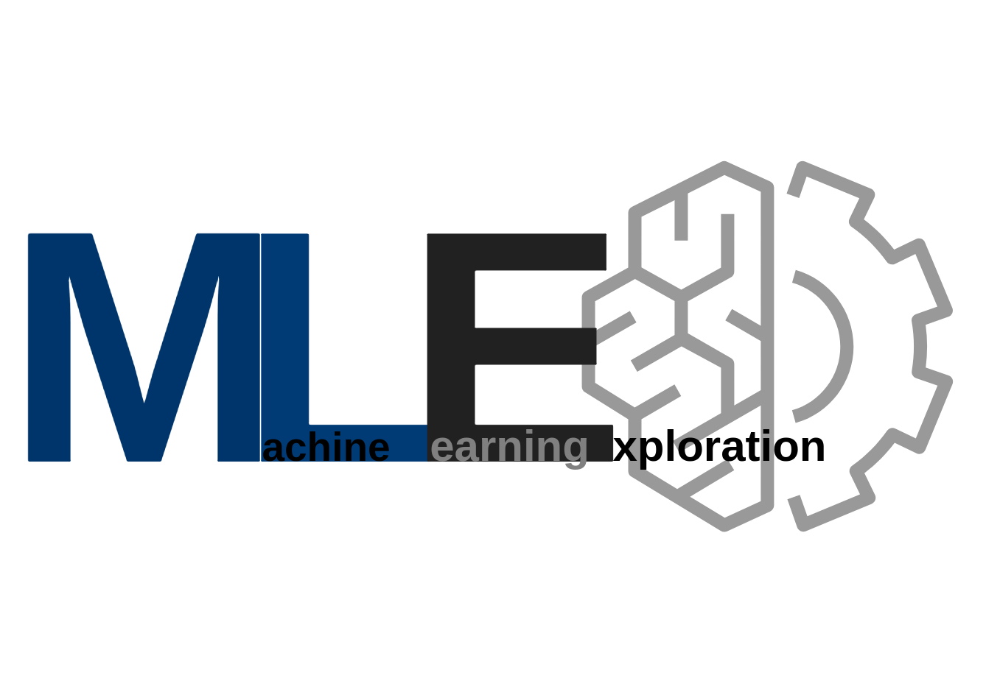

====================================================
The amateur's guide to explore machine learning
====================================================

HELLO THERE !!!

Welcome. 

This doc is my exploration of machine learning and data science that I am developing as I am learning.
I am learning things at a slow pace and I tend to forget logics/ methods/ formulas/ codes. To keep everything at one place so that I can go through the topic quickly for reference. Now just to help other people who are also starting to learn these topics, this doc may be helpful.
Validation of the content is done by people who are visiting it. On the other hand, sometimes results are proof. 
I understand the topic mostly from a free course, video, research paper or book and try it (most references are mentioned with the topic).

+-----------+--------------------------------------------+
| email     | nishantbaheti.it19@gmail.com               |
+-----------+--------------------------------------------+
| github    | https://www.github.com/nishantbaheti       |
+-----------+--------------------------------------------+
| linkedin  | https://www.linkedin.com/in/nishantbaheti/ |
+-----------+--------------------------------------------+
    
If I haven't mentioned your work's reference correctly then let me know. I am more than happy to correct the situation.

