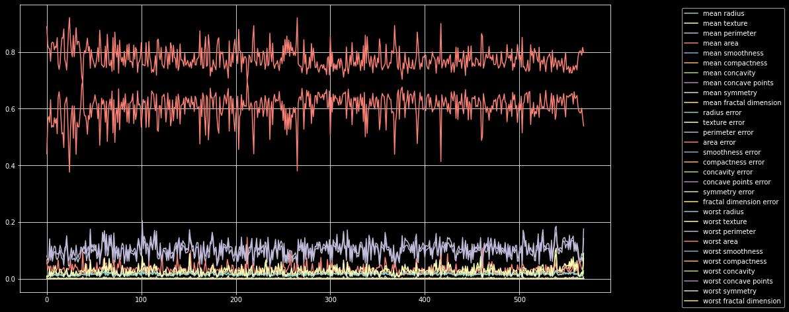

Breast Cancer Preprocessing Analysis
====================================

.. code:: ipython3

    datasetUrl = 'https://archive.ics.uci.edu/ml/machine-learning-databases/breast-cancer-wisconsin/wdbc.data'
    
    headers = ['gender','mean radius', 
    'mean texture', 'mean perimeter', 
    'mean area', 'mean smoothness', 
    'mean compactness', 'mean concavity',
    'mean concave points', 'mean symmetry',
    'mean fractal dimension','radius error',
    'texture error','perimeter error',
    'area error', 'smoothness error',
    'compactness error','concavity error',
    'concave points error','symmetry error',
    'fractal dimension error','worst radius',
    'worst texture', 'worst perimeter', 
    'worst area','worst smoothness', 
    'worst compactness', 'worst concavity',
    'worst concave points','worst symmetry',
    'worst fractal dimension']

.. code:: ipython3

    import pandas as pd
    
    
    cancerDf = pd.read_csv(datasetUrl, header= None)
    cancerDf = cancerDf.loc[:,1:]
    cancerDf.columns = headers

Preprocessing is a step, in which raw data is modified or transformed into a format, suitable for further downstream processing.
^^^^^^^^^^^^^^^^^^^^^^^^^^^^^^^^^^^^^^^^^^^^^^^^^^^^^^^^^^^^^^^^^^^^^^^^^^^^^^^^^^^^^^^^^^^^^^^^^^^^^^^^^^^^^^^^^^^^^^^^^^^^^^^^

scikit-learn provides many preprocessing utilities such as, -
Standardization mean removal - Scaling - Normalization - Binarization -
One Hot Encoding - Label Encoding - Imputation

.. code:: ipython3

    import matplotlib.pyplot as plt 
    import seaborn as sns 
    plt.rcParams.update({
        "figure.figsize" : (16,8),
        "axes.grid" : True
    })
    
    plt.style.use('dark_background')

.. code:: ipython3

    for column in cancerDf.iloc[:,1:].columns:
        plt.plot(cancerDf[column],label=column)
    plt.legend(loc="upper right",bbox_to_anchor=(1.3,1.0))
    plt.show()

.. code:: ipython3

    import sklearn.preprocessing as ppUtil
    import numpy as np

.. code:: ipython3

    ## Standard Scaler Operaton 
    data = cancerDf.iloc[:,1:]
    scaledData = pd.DataFrame(ppUtil.StandardScaler().fit_transform(data) , columns=data.columns)
    # plt.plot(data)
    for column in scaledData.columns:    
        plt.plot(scaledData[column],label=column)
    plt.legend(loc="upper right",bbox_to_anchor=(1.3,1.0))
    plt.show()
    
    sns.distplot(scaledData)
    plt.show()

.. code:: ipython3

    ## Min Max Scaler Operaton 
    data = cancerDf.iloc[:,1:]
    
    ### default is (0,1) but can be changed
    ### MinMaxScaler(feature_range=(0,10))
    
    scaledData = pd.DataFrame(ppUtil.MinMaxScaler().fit_transform(data) , columns=data.columns)
    # plt.plot(data)
    for column in scaledData.columns:    
        plt.plot(scaledData[column],label=column)
    plt.legend(loc="upper right",bbox_to_anchor=(1.3,1.0))
    plt.show()
    
    sns.distplot(scaledData)
    plt.show()

.. image:: BreastCancerPreprocessingAnalysis_files/BreastCancerPreprocessingAnalysis_8_0.png

.. image:: BreastCancerPreprocessingAnalysis_files/BreastCancerPreprocessingAnalysis_8_1.png

.. code:: ipython3

    ## Max Abs Scaler Operaton 
    data = cancerDf.iloc[:,1:]
    
    scaledData = pd.DataFrame(ppUtil.MaxAbsScaler().fit_transform(data) , columns=data.columns)
    # plt.plot(data)
    for column in scaledData.columns:    
        plt.plot(scaledData[column],label=column) 
    plt.legend(loc="upper right",bbox_to_anchor=(1.3,1.0))
    plt.show()
    
    sns.distplot(scaledData)
    plt.show()

.. code:: ipython3

    ## Normalizer Operaton l1
    data = cancerDf.iloc[:,1:]
    
    scaledData = pd.DataFrame(ppUtil.Normalizer(norm="l1").fit_transform(data) , columns=data.columns)
    # plt.plot(data)l
    for column in scaledData.columns:    
        plt.plot(scaledData[column],label=column) 
    plt.legend(loc="upper right",bbox_to_anchor=(1.3,1.0))
    plt.show()
    
    sns.distplot(scaledData)
    plt.show()

.. image:: BreastCancerPreprocessingAnalysis_files/BreastCancerPreprocessingAnalysis_10_0.png

.. image:: BreastCancerPreprocessingAnalysis_files/BreastCancerPreprocessingAnalysis_10_1.png

.. code:: ipython3

    ## Normalizer Operaton l2
    data = cancerDf.iloc[:,1:]
    
    scaledData = pd.DataFrame(ppUtil.Normalizer(norm="l2").fit_transform(data) , columns=data.columns)
    # plt.plot(data)l
    for column in scaledData.columns:    
        plt.plot(scaledData[column],label=column) 
    plt.legend(loc="upper right",bbox_to_anchor=(1.3,1.0))
    plt.show()
    
    sns.distplot(scaledData)
    plt.show()

.. code:: ipython3

    ## Normalizer Operaton max
    data = cancerDf.iloc[:,1:]
    
    scaledData = pd.DataFrame(ppUtil.Normalizer(norm="max").fit_transform(data) , columns=data.columns)
    # plt.plot(data)l
    for column in scaledData.columns:    
        plt.plot(scaledData[column],label=column) 
    plt.legend(loc="upper right",bbox_to_anchor=(1.3,1.0))
    plt.show()
    
    sns.distplot(scaledData)
    plt.show()

.. image:: BreastCancerPreprocessingAnalysis_files/BreastCancerPreprocessingAnalysis_12_0.png

.. image:: BreastCancerPreprocessingAnalysis_files/BreastCancerPreprocessingAnalysis_12_1.png

.. code:: ipython3

    ### One Hot Encoding 
    
    data = cancerDf['gender'].values.reshape(-1,1)
    oneHotEncodedData = ppUtil.OneHotEncoder().fit(data).transform(data).toarray()
    
    print(oneHotEncodedData)

.. parsed-literal::

    [[0. 1.]
     [0. 1.]
     [0. 1.]
     ...
     [0. 1.]
     [0. 1.]
     [1. 0.]]

.. code:: ipython3

    ### Label Encoding 
    data = cancerDf['gender'].values.reshape(-1,1)
    labelEncodedData = ppUtil.LabelEncoder().fit(data).transform(data).reshape(-1,1)
    # print(data,labelEncodedData)

.. parsed-literal::

    /home/nishant/anaconda3/lib/python3.8/site-packages/sklearn/utils/validation.py:73: DataConversionWarning: A column-vector y was passed when a 1d array was expected. Please change the shape of y to (n_samples, ), for example using ravel().
      return f(**kwargs)

.. code:: ipython3

    ### Imputation 
    from sklearn.impute import SimpleImputer as simp 
    
    imputer = simp(missing_values=np.nan, strategy='mean')
    imputedData = imputer.fit(cancerDf['mean radius'].values.reshape(-1,1)).transform(cancerDf['mean radius'].values.reshape(-1,1))
    

