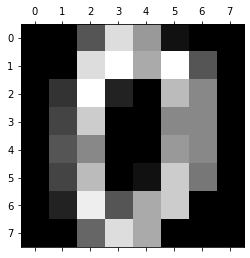

Digits Data Analysis and Modelling
==================================

.. code:: ipython3

    import pandas as pd 
    from sklearn.datasets import load_digits
    from sklearn.model_selection import train_test_split
    from sklearn.svm import SVC
    from sklearn.svm import NuSVC
    from sklearn.svm import LinearSVC
    import matplotlib.pyplot as plt 

.. code:: ipython3

    digits = load_digits()

.. code:: ipython3

    # plt.gray()
    for i in range(0,10):
        plt.matshow(digits.data[i].reshape(8,8)) 
    #     plt.matshow(digits.images[i].reshape(8,8)) 
        plt.show() 

.. image:: DigitsDataModelling_files/DigitsDataModelling_3_3.png

.. image:: DigitsDataModelling_files/DigitsDataModelling_3_5.png

.. image:: DigitsDataModelling_files/DigitsDataModelling_3_6.png

.. image:: DigitsDataModelling_files/DigitsDataModelling_3_7.png

.. image:: DigitsDataModelling_files/DigitsDataModelling_3_8.png

.. image:: DigitsDataModelling_files/DigitsDataModelling_3_9.png

.. code:: ipython3

    xTrain,xTest,yTrain,yTest = train_test_split(digits.data,digits.target,random_state = 30)

.. code:: ipython3

    svcModelObj = SVC()
    svcModel = svcModelObj.fit(xTrain,yTrain)
    
    print(f"Training Acccuracy : {svcModel.score(xTrain,yTrain)}")
    print(f"Testing Accuracy : {svcModel.score(xTest,yTest)}")

.. parsed-literal::

    Training Acccuracy : 0.9962880475129918
    Testing Accuracy : 0.9866666666666667

