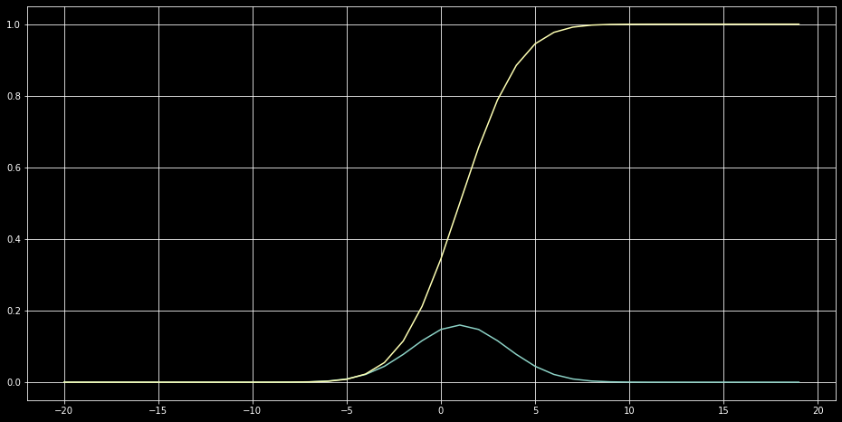
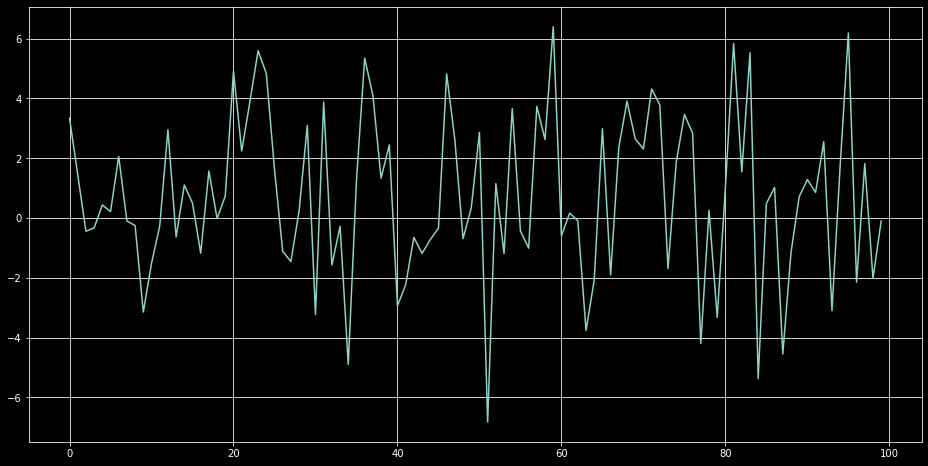

Statisitcs
==========

.. code:: ipython3

    from scipy import stats 
    import numpy as np 
    import matplotlib.pyplot as plt 
    import seaborn as sns 
    plt.rcParams.update({
        "figure.figsize" : (16,8),
        "axes.grid" : True
    })
    
    plt.style.use('dark_background')

.. code:: ipython3

    a = np.array([86, 47, 45, 47, 40, 97, 98, 75, 65, 83])

.. code:: ipython3

    ## mean
    a.mean()

.. parsed-literal::

    68.3

.. code:: ipython3

    ## median
    np.median(a)

.. parsed-literal::

    70.0

.. code:: ipython3

    ## variance 
    ## average of squared difference of each datapoint from dataset's mean
    a.var()

.. parsed-literal::

    454.21000000000004

.. code:: ipython3

    ## standard deviation 
    ## sqrt of variance 
    a.std()

.. parsed-literal::

    21.312203077110542

.. code:: ipython3

    ## std and var 
    ## for sample of data not entire population
    a.var(ddof=1) , a.std(ddof=1)

.. parsed-literal::

    (504.6777777777778, 22.46503455990615)

.. code:: ipython3

    ## mode
    stats.mode(a)

.. parsed-literal::

    ModeResult(mode=array([47]), count=array([2]))

.. code:: ipython3

    ## range (max - min)
    np.ptp(a)

.. parsed-literal::

    58

.. code:: ipython3

    ## percentile 
    ## a value ,below which lies given the percentage of data points 
    np.percentile(a,100,interpolation='lower')

.. parsed-literal::

    98

.. code:: ipython3

    ## Quartiles 
    np.percentile(a,[25,50,75],interpolation='lower')

.. parsed-literal::

    array([47, 65, 83])

.. code:: ipython3

    ## Inter Quartile Range (IQR) 
    ## difference between third quartile Q3 and first quartile Q1
    
    stats.iqr(a,rng=(25,75),interpolation="lower")

.. parsed-literal::

    36

skewness
^^^^^^^^

-  majority of the data present on side of the distribution

============== ============== ========
type1          type2          type3
============== ============== ========
right skewed   left skewed    unskewed
positive value negative value zero
============== ============== ========

.. code:: ipython3

    ## skewed 
    stats.skew(a)

.. parsed-literal::

    0.04321019390325423

Kurtosis
^^^^^^^^

-  indicates how much of data is concentrated around mean or shape of
   the probability distribution.
-  default Ficsher definition
-  can be changed to pearson

.. code:: ipython3

    ## kurtosis
    stats.kurtosis(a)

.. parsed-literal::

    -1.5694354898634155

Random Sampling
---------------

-  Select Items randomly from population, either with or without
   replacement.
-  Random choice

.. code:: ipython3

    ## 2 items are selected randomly 
    
    np.random.choice([12,11,56,23],2,replace=False)

.. parsed-literal::

    array([11, 56])

Random Seeding
--------------

-  To get random choice generated but has to be generated everytime has
   to be same for peer checking or to generate same results. Get same
   randomly generated sequence everytime if seed value is determined.
-  SEED is a value sets initial state of random number generator.

.. code:: ipython3

    ## It will generate same random number everytime 
    np.random.seed(100)
    np.random.rand()

.. parsed-literal::

    0.5434049417909654

Random Variable
---------------

-  A set of all possible outcomes of a random experiment is called
   SAMPLE SPACE
-  probability of all outcomes : Probability Distribution
-  Random Variable maps to one of the outcomes of the sample space

Probability Distributions
-------------------------

::

       Discrete Probability Distribution 
                   |
                   v
       Probability Mass Function
                   |
                   v
       Continuous form
                   |
                   v
       Probability Density Function 

+------------------------------------------+---------------------------+
| Distribution Type                        | Examples                  |
+==========================================+===========================+
| Discrete Distribution                    | Binomial, Poisson,        |
|                                          | Hypergeometric,           |
|                                          | Multinomial, Negative     |
|                                          | Binomial                  |
+------------------------------------------+---------------------------+
| Continuous Distribution                  | Normal, Uniform,          |
|                                          | Chi-Sqaure, F, T          |
+------------------------------------------+---------------------------+

Random Distributions
--------------------

scipy.stats module provide a lot of methods for created discrete and
continuous random variables.

Commonly used methods are described below.

-  pdf / pmf : Probability distribution function (continuous) or
   probability mass function (discrete).
-  cdf : Cumulative distribution function.
-  sf : Survival function (1 – cdf).
-  rvs : Creating random samples from a distribution.

-  The following example defines a normal continuous random variable of
   mean 1.0 and std 2.5.
-  It also estimates probabilities and cumulative probabilities at -1, 0
   and 1.
-  The example also generates six random numbers from defined normal
   distribution.

.. code:: ipython3

    normObj = stats.norm(loc=1.0, scale=2.5)
    
    print(normObj.pdf([-1, 0, 1]))
    
    print(normObj.cdf([-1, 0, 1]))
    
    print(normObj.rvs((2,3)))

.. parsed-literal::

    [0.11587662 0.14730806 0.15957691]
    [0.2118554  0.34457826 0.5       ]
    [[-0.40409689 -3.12269376  1.88668613]
     [-0.96516083  0.42031951  1.5199392 ]]

.. code:: ipython3

    data = range(-20,20)
    plt.plot(data,normObj.pdf(data))
    plt.plot(data,normObj.cdf(data))
    plt.show()

.. code:: ipython3

    plt.plot(normObj.rvs(100))
    plt.show()

.. code:: ipython3

    ## n and p as shape parameters 
    binomObj = stats.binom(n = 5,p = 0.5)
    
    plt.plot(binomObj.pmf(range(-10,10)))
    plt.plot(binomObj.cdf(range(-10,10)))
    plt.show()

.. image:: Statistics_files/Statistics_28_0.png

.. code:: ipython3

    
    plt.plot(binomObj.rvs(50))
    plt.show()

.. image:: Statistics_files/Statistics_29_0.png

