Matplotlib Visualization
========================

.. code:: ipython3

    import matplotlib 
    
    
    # matplotlib.use('WXAgg')
    
    
    import matplotlib.pyplot as plt
    import random    
    import pandas as pd 
    import numpy as np
    
    
    # plt.style.reload_library()
    
    # plt.style.use('dark-background')
    
    %matplotlib inline

.. code:: ipython3

    def generateArray(size = 10):
        return [random.randrange(1,30) for _ in range(size)]
        

.. code:: ipython3

    print(plt.style.available)

.. parsed-literal::

    ['Solarize_Light2', '_classic_test_patch', 'bmh', 'classic', 'dark_background', 'fast', 'fivethirtyeight', 'ggplot', 'grayscale', 'seaborn', 'seaborn-bright', 'seaborn-colorblind', 'seaborn-dark', 'seaborn-dark-palette', 'seaborn-darkgrid', 'seaborn-deep', 'seaborn-muted', 'seaborn-notebook', 'seaborn-paper', 'seaborn-pastel', 'seaborn-poster', 'seaborn-talk', 'seaborn-ticks', 'seaborn-white', 'seaborn-whitegrid', 'tableau-colorblind10']

.. code:: ipython3

    
    fig = plt.figure(figsize=(8,6))
    ax = fig.add_subplot(111)
    ax.set(title='Avg. Daily Temperature of Dec 2020',
          xlabel='Day', ylabel='Temperature (in deg)',
          xlim=(0, 30), ylim=(0, 35))
    days = [1, 5, 8, 12, 15, 19, 22, 26, 29]
    location1_temp = generateArray(9)
    location2_temp = generateArray(9)
    ax.plot(days, location1_temp, color='green', marker='o', linewidth=3, label="First",ls="--")
    ax.plot(days, location2_temp, color='red', marker='o', linewidth=3, label="Second")
    ax.grid(True)
    ax.legend()
    plt.show()

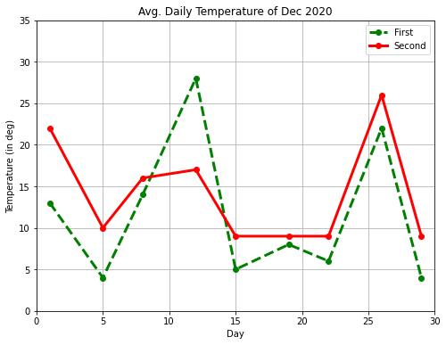

.. code:: ipython3

    fig = plt.figure(figsize=(8,6))
    ax = fig.add_subplot(111)
    ax.set(title='Avg. Daily Temperature of December 2021',
          xlabel='Day', ylabel='Temperature (in deg)',
          xlim=(0, 30), ylim=(0, 35))
    days = [1, 5, 8, 12, 15, 19, 22, 26, 29]
    temp = generateArray(9)
    ax.scatter(days, temp, marker='p',s=[60],edgecolor='cyan')
    ax.grid(True)
    plt.show()

.. code:: ipython3

    fig = plt.figure(figsize=(8,6))
    ax = fig.add_subplot(111)
    ax.set(title='Avg. Quarterly Sales',
          xlabel='Quarter', ylabel='Sales (in millions)')
    quarters = [1, 2, 3]
    x1_index = [0.8, 1.8, 2.8]; x2_index = [1.2, 2.2, 3.2]
    sales_2016 = [28831, 30762, 32178]; sales_2017 = [25782, 35783, 36133]
    ax.bar(x1_index, sales_2016, color='yellow', width=0.4, edgecolor='black', label='2016')
    ax.bar(x2_index, sales_2017, color='red', width=0.4, edgecolor='black', label='2017')
    ax.set_xticks(quarters)
    ax.set_xticklabels(['Q1', 'Q2', 'Q3'])
    ax.legend()
    plt.show()

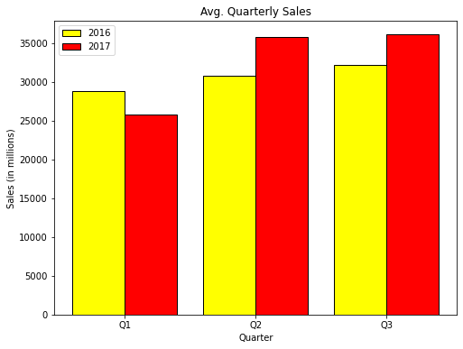

.. code:: ipython3

    fig = plt.figure(figsize=(6,6))
    ax = fig.add_subplot(111)
    ax.set(title='Avg. Quarterly Sales')
    sales_2017 = [25782, 35783, 36133]
    quarters = ['Q1-2017', 'Q2-2017', 'Q3-2017']
    ax.pie(sales_2017, labels=quarters, startangle=90, autopct='%1.1f%%',shadow=True)
    plt.show()

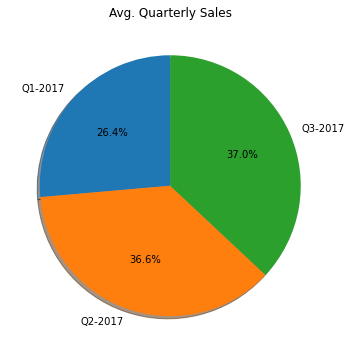

.. code:: ipython3

    import numpy as np
    np.random.seed(100)
    x = 60 + 10*np.random.randn(1000)
    fig = plt.figure(figsize=(8,6))
    ax = fig.add_subplot(111)
    ax.set(title="Distribution of Student's Percentage",
          ylabel='Count', xlabel='Percentage')
    ax.hist(x,bins=100,color='green')
    ax.axvline(x.mean(),c='r')
    ax.axvline(np.median(x),c='y')
    plt.show()

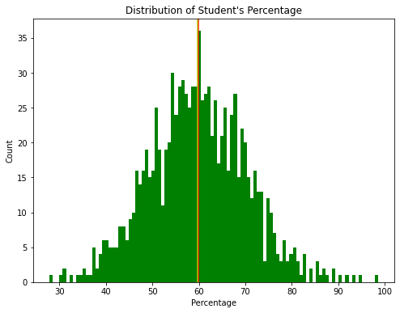

.. code:: ipython3

    import numpy as np
    np.random.seed(100)
    x = 50 + 10*np.random.randn(1000)
    y = 70 + 25*np.random.randn(1000)
    z = 30 + 5*np.random.randn(1000)
    fig = plt.figure(figsize=(8,6))
    ax = fig.add_subplot(111)
    ax.set(title="Box plot of Student's Percentage",
          xlabel='Class', ylabel='Percentage')
    ax.boxplot([x, y, z], labels=['A', 'B', 'C'], notch=True, bootstrap=10000,patch_artist=True)
    plt.show()

.. code:: ipython3

    fig = plt.figure(figsize=(10,8))
    axes1 = plt.subplot(2, 2, 1, title='Plot1')
    axes2 = plt.subplot(2, 2, 2, title='Plot2')
    axes3 = plt.subplot(2, 2, 3, title='Plot3')
    axes4 = plt.subplot(2, 2, 4, title='Plot4')
    plt.show()

.. code:: ipython3

    fig = plt.figure(figsize=(10,8))
    axes1 = plt.subplot(2, 2, (1,2), title='Plot1')
    axes1.set_xticks([]); axes1.set_yticks([])
    axes2 = plt.subplot(2, 2, 3, title='Plot2')
    axes2.set_xticks([]); axes2.set_yticks([])
    axes3 = plt.subplot(2, 2, 4, title='Plot3')
    axes3.set_xticks([]); axes3.set_yticks([])
    plt.show()

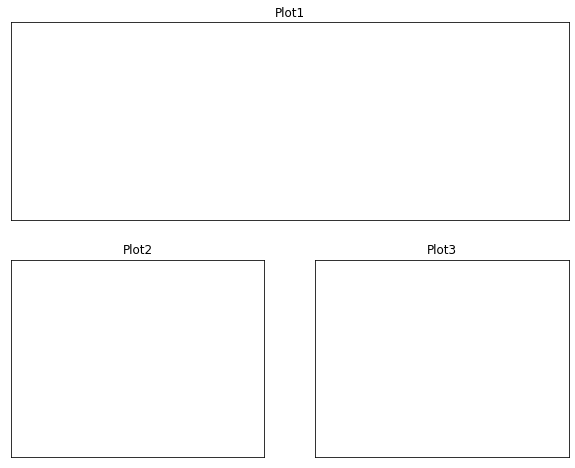

.. code:: ipython3

    import matplotlib.gridspec as gridspec
    import matplotlib.pyplot as plt
    fig = plt.figure(figsize=(10,8))
    gd = gridspec.GridSpec(2,2)
    axes1 = plt.subplot(gd[0,:],title='Plot1')
    axes1.set_xticks([]); axes1.set_yticks([])
    axes2 = plt.subplot(gd[1,0])
    axes2.set_xticks([]); axes2.set_yticks([])
    axes3 = plt.subplot(gd[1,-1])
    axes3.set_xticks([]); axes3.set_yticks([])
    plt.show()

.. parsed-literal::

    <ipython-input-27-32abc037f70e>:9: MatplotlibDeprecationWarning: Adding an axes using the same arguments as a previous axes currently reuses the earlier instance.  In a future version, a new instance will always be created and returned.  Meanwhile, this warning can be suppressed, and the future behavior ensured, by passing a unique label to each axes instance.
      axes3 = plt.subplot(gd[1,-1])
    <ipython-input-27-32abc037f70e>:11: UserWarning: Matplotlib is currently using agg, which is a non-GUI backend, so cannot show the figure.
      plt.show()

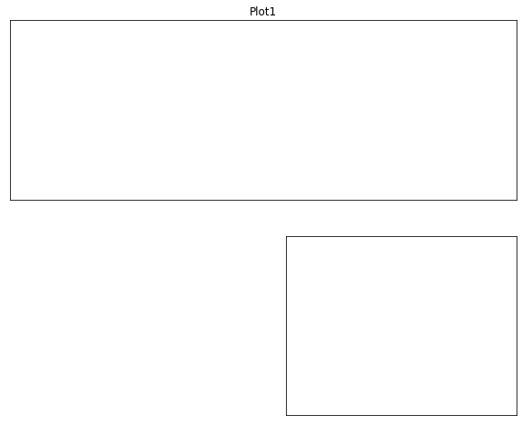

.. code:: ipython3

    import matplotlib.gridspec as gridspec
    fig = plt.figure()
    gs = gridspec.GridSpec(3, 3)
    ax1 = plt.subplot(gs[:2, :2])
    ax2 = plt.subplot(gs[0, 2])
    ax3 = plt.subplot(gs[1, 2])
    ax4 = plt.subplot(gs[-1, 0])
    ax5 = plt.subplot(gs[-1, 1:])
    plt.show()

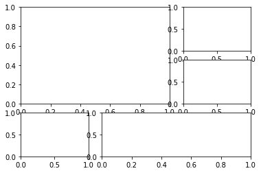

.. code:: ipython3

    axes1 = plt.subplot(2, 2, (1,3), title='Plot1')
    axes2 = plt.subplot(2, 2, 2, title='Plot2')
    axes3 = plt.subplot(2, 2, 4, title='Plot3')
    plt.show()

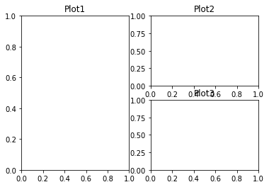

.. code:: ipython3

    import matplotlib.gridspec as gridspec
    fig = plt.figure()
    gs = gridspec.GridSpec(3, 3)
    ax1 = plt.subplot(gs[0, :])
    ax2 = plt.subplot(gs[1, :-1])
    ax3 = plt.subplot(gs[1:, -1])
    ax4 = plt.subplot(gs[-1, 0])
    ax5 = plt.subplot(gs[-1, -2])
    plt.show()

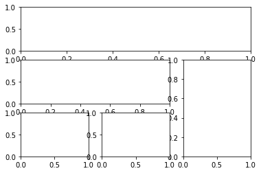

.. code:: ipython3

    import matplotlib
    matplotlib.use('Agg')
    import matplotlib.pyplot as plt
    import numpy as np
    import matplotlib.gridspec as gridspec
    #Write your code here
    
    def test_sine_wave_plot():
    
        fig = plt.figure(figsize=(12,3))
    
        ax = fig.add_subplot(111)
        ax.set(
        xlabel="Time (seconds)",
        ylabel="Voltage (mV)",
        title="Sine Wave",
        xlim=(0,2),
        ylim=(-1,1),
        xticks=[0,0.2,0.4,0.6,0.8,1.0,1.2,1.4,1.6,1.8,2.0],
        yticks=[-1,0,1]
        )
        t = np.linspace(0.0,2.0,num=200)
        v = np.sin(2.5 * np.pi*t)
        ax.plot(t,v,c='r',label="sin(t)")
        ax.grid(linestyle="--")
        ax.legend()
        plt.savefig('./sinewave.png')
    
    
    test_sine_wave_plot()
    
    def test_multi_curve_plot():
    
        fig = plt.figure(figsize=(12,3))
    
        ax = fig.add_subplot(111)
        ax.set(
        xlabel="x",
        ylabel="f(x)",
        title="Linear, Quadratic, & Cubic Equations",
        )
        x = np.linspace(0.0,5.0,num=20)
        y1 = x
        y2 = x**2
        y3 = x**3
    
        ax.plot(x,y1,c='r',marker="o",label="y = x")
        ax.plot(x,y2,c='g',marker="s",label="y = x**2")
        ax.plot(x,y3,c='b',marker='^',label="y = x**3")
        ax.legend()
        plt.savefig('./multicurve.png')
    
    test_multi_curve_plot()
    
    def test_scatter_plot():
    
        fig = plt.figure(figsize=(12,3))
    
        ax = fig.add_subplot(111)
        ax.set(
        xlabel="Months",
        ylabel="No. of Cars Sold",
        title="Cats Sold by Company 'X' in 2017",
        xlim=(0,13),
        ylim=(20,100),
        xticks=[1,3,5,7,9,11],
        xticklabels=['Jan','Mar','May','Jul','Sep','Nov']
        )
        s = [50,60,55,50,70,65,75,65,80,90,93,95]
        months = [1,2,3,4,5,6,7,8,9,10,11,12]
    
        ax.scatter(months,s,c='r')
        plt.savefig('./scatter.png')
    
    test_scatter_plot()

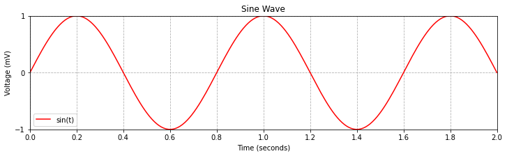

.. code:: ipython3

    import matplotlib
    matplotlib.use('Agg')
    import matplotlib.pyplot as plt
    import numpy as np
    import matplotlib.gridspec as gridspec
    #Write your code here
    
    
    def test_barplot_of_iris_sepal_length():
    
        fig = plt.figure(figsize=(8,6))
        ax = fig.add_subplot(111)
        ax.set(
        xlabel="Species",
        ylabel="Sepal Length (cm)",
        title="Mean Sepal Length of Iris Species",
        xlim=(0,3),
        ylim=(0,7),
        xticks=[0.45,1.45,2.45],
        xticklabels=['setosa','versicolor','virginica']
        )
        species = ['setosa','versicolor','virginica']
        index = [0.2,1.2,2.2]
        sepal_len = [5.01,5.94,6.59]
    
        ax.bar(index,sepal_len,width=0.5,color='red',edgecolor='black')
        plt.savefig('./bar_iris_sepal.png')
    
    
    test_barplot_of_iris_sepal_length()
    
    
    def test_barplot_of_iris_measurements():
    
        fig = plt.figure(figsize=(8,6))
        ax = fig.add_subplot(111)
        ax.set(
        xlabel="Species",
        ylabel="Iris Measurements (cm)",
        title="Mean Measurements of Iris Species",
        xlim=(0.5,3.7),
        ylim=(0,10),
        xticks=[1.1,2.1,3.1],
        xticklabels=['setosa','versicolor','virginica']
        )
    
        sepal_len = [ 5.01,5.94,6.59 ]
        sepal_wd = [ 3.42,2.77,2.97 ]
        petal_len = [1.46,4.26,5.55 ]
        petal_wd = [ 0.24, 1.33,2.03]
        species = ['setosa','versicolor','virginica']
        species_index1 = [0.7,1.7,2.7]
        species_index2 = [0.9,1.9,2.9]
        species_index3 = [1.1,2.1,3.1]
        species_index4 = [1.3,2.3,3.3]
        sepal_len = [5.01,5.94,6.59]
    
        ax.bar(species_index1 ,sepal_len,width=0.2,color='c',edgecolor='black',label="Sepal Length")
        ax.bar(species_index2 ,sepal_wd,width=0.2,color='m',edgecolor='black',label="Sepal Width")
        ax.bar(species_index3 ,petal_len,width=0.2,color='y',edgecolor='black',label="Petal Length")
        ax.bar(species_index4 ,petal_wd,width=0.2,color='orange',edgecolor='black',label="Petal Width")
        ax.legend()
        plt.savefig('./bar_iris_measure.png')
    
    test_barplot_of_iris_measurements()
    
    
    def test_hbar_of_iris_petal_length():
    
        fig = plt.figure(figsize=(12,5))
        ax = fig.add_subplot(111)
        ax.set(
        xlabel="Petal Length (cm)",
        ylabel="Species",
        title="Mean Petal Length of Iris Species",
        yticks=[0.45,1.45,2.45],
        yticklabels=['setosa','versicolor','virginica']
        )
    
        species = ['setosa','versicolor','virginica']
        index = [0.2,1.2,2.2]
        petal_len = [1.46,4.26,5.55]
    
        ax.barh(index,petal_len,height=0.5,color='c',edgecolor='black')
        plt.savefig('./bar_iris_petal.png')
    
    test_hbar_of_iris_petal_length()

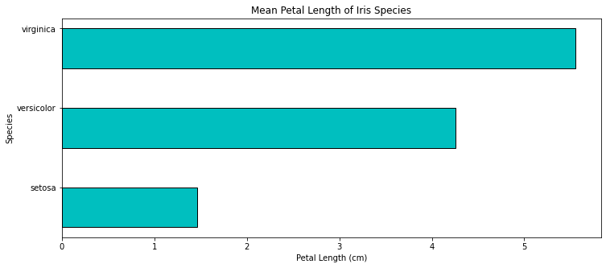

.. code:: ipython3

    import matplotlib
    matplotlib.use('Agg')
    import matplotlib.pyplot as plt
    import numpy as np
    import matplotlib.gridspec as gridspec
    #Write your code here
    
    
    
    def test_hist_of_a_sample_normal_distribution():
        np.random.seed(100)
        fig = plt.figure(figsize=(8,6))
        ax = fig.add_subplot(111)
        ax.set(
        xlabel="X1",
        ylabel="Bin Count",
        title="Histogram of a Single Dataset"
        )
    
        x1 = 25 + 3*np.random.randn(1000)
    
        ax.hist(x1,bins=30)
        plt.savefig("./histogram_normal.png")
    
    test_hist_of_a_sample_normal_distribution()
    
    
    def test_boxplot_of_four_normal_distribution():
        np.random.seed(100)
        fig = plt.figure(figsize=(8,6))
        ax = fig.add_subplot(111)
        ax.set(
        xlabel="Dataset",
        ylabel="Value",
        title="Box plot of Multiple Datasets"
        )
    
        x1 = 25 + 3.0*np.random.randn(1000)
        x2 = 35 + 5.0*np.random.randn(1000)
        x3 = 55 + 10.0*np.random.randn(1000)
        x4 = 45 + 3.0*np.random.randn(1000)
    
        labels = ['X1','X2','X3','X4']
    
        ax.boxplot([x1,x2,x3,x4],labels=labels,notch=True,flierprops=dict(marker="+",),patch_artist=True)
        plt.savefig("./box_distribution.png")
    
    test_boxplot_of_four_normal_distribution()

.. code:: ipython3

    fig = plt.figure(figsize=(8,6))
    ax = fig.add_subplot(111)
    ax.set(title='Writing Text',
          xlabel='X-Axis', ylabel='Y-Axis',
          xlim=(0, 5), ylim=(0, 9))
    x = [1, 2, 3, 4]
    y = [2, 4, 6, 8]
    ax.scatter(x, y, c=['green'], s=[60], edgecolor='black')
    for i in range(len(x)):
        str_temp = '({}, {})'.format(x[i] - 0.2, y[i] + 0.4)
        ax.text(x[i] - 0.4, y[i] + 0.4, str_temp, fontsize=16)
    plt.show()

.. parsed-literal::

    <ipython-input-19-4284551b6031>:12: UserWarning: Matplotlib is currently using agg, which is a non-GUI backend, so cannot show the figure.
      plt.show()

.. code:: ipython3

    import matplotlib
    matplotlib.use('Agg')
    import matplotlib.pyplot as plt
    import numpy as np
    import matplotlib.gridspec as gridspec
    #Write your code here
    
    
    def test_generate_plot_with_style1():
        with plt.style.context('ggplot'):
        fig = plt.figure(figsize=(8,6))
        ax = fig.add_subplot(111)
        ax.set(
          xlabel="Species",
          ylabel="Iris Measurements (cm)",
          title="Mean Measurements of Iris Species",
          xlim=(0.5,3.7),
          ylim=(0,10),
          xticks=[1.1,2.1,3.1],
          xticklabels=['setosa','versicolor','virginica']
        )
        sepal_len=[5.01,5.94,6.59]
        sepal_wd=[3.42,2.77,2.97]
        petal_len=[1.46,4.26,5.55]
        petal_wd=[0.24,1.33,2.03]
    
        species = ['setosa','versicolor','virginica']
    
        species_index1=[0.7,1.7,2.7]
        species_index2=[0.9,1.9,2.9]
        species_index3=[1.1,2.1,3.1]
        species_index4=[1.3,2.3,3.3]
    
        ax.bar(species_index1,sepal_len,width=0.2,label="Sepal Length")
        ax.bar(species_index2,sepal_wd,width=0.2,label="Sepal Width")
        ax.bar(species_index3,petal_len,width=0.2,label="Petal Length")
        ax.bar(species_index4,petal_wd,width=0.2,label="Petal Width")
    
        ax.legend()
        plt.savefig("./plotstyle1.png")
    
    
    test_generate_plot_with_style1()
    
    
    def test_generate_plot_with_style2():
        with plt.style.context('seaborn-colorblind'):
        fig = plt.figure(figsize=(8,6))
        ax = fig.add_subplot(111)
        ax.set(
          xlabel="Species",
          ylabel="Iris Measurements (cm)",
          title="Mean Measurements of Iris Species",
          xlim=(0.5,3.7),
          ylim=(0,10),
          xticks=[1.1,2.1,3.1],
          xticklabels=['setosa','versicolor','virginica']
        )
        sepal_len=[5.01,5.94,6.59]
        sepal_wd=[3.42,2.77,2.97]
        petal_len=[1.46,4.26,5.55]
        petal_wd=[0.24,1.33,2.03]
    
        species = ['setosa','versicolor','virginica']
    
        species_index1=[0.7,1.7,2.7]
        species_index2=[0.9,1.9,2.9]
        species_index3=[1.1,2.1,3.1]
        species_index4=[1.3,2.3,3.3]
    
        ax.bar(species_index1,sepal_len,width=0.2,label="Sepal Length")
        ax.bar(species_index2,sepal_wd,width=0.2,label="Sepal Width")
        ax.bar(species_index3,petal_len,width=0.2,label="Petal Length")
        ax.bar(species_index4,petal_wd,width=0.2,label="Petal Width")
    
        ax.legend()
        plt.savefig("./plotstyle2.png")
    
    test_generate_plot_with_style2()
    
    def test_generate_plot_with_style3():
        with plt.style.context('grayscale'):
        fig = plt.figure(figsize=(8,6))
        ax = fig.add_subplot(111)
        ax.set(
          xlabel="Species",
          ylabel="Iris Measurements (cm)",
          title="Mean Measurements of Iris Species",
          xlim=(0.5,3.7),
          ylim=(0,10),
          xticks=[1.1,2.1,3.1],
          xticklabels=['setosa','versicolor','virginica']
        )
        sepal_len=[5.01,5.94,6.59]
        sepal_wd=[3.42,2.77,2.97]
        petal_len=[1.46,4.26,5.55]
        petal_wd=[0.24,1.33,2.03]
    
        species = ['setosa','versicolor','virginica']
    
        species_index1=[0.7,1.7,2.7]
        species_index2=[0.9,1.9,2.9]
        species_index3=[1.1,2.1,3.1]
        species_index4=[1.3,2.3,3.3]
    
        ax.bar(species_index1,sepal_len,width=0.2,label="Sepal Length")
        ax.bar(species_index2,sepal_wd,width=0.2,label="Sepal Width")
        ax.bar(species_index3,petal_len,width=0.2,label="Petal Length")
        ax.bar(species_index4,petal_wd,width=0.2,label="Petal Width")
    
        ax.legend()
        plt.savefig("./plotstyle3.png")
    
    test_generate_plot_with_style3()

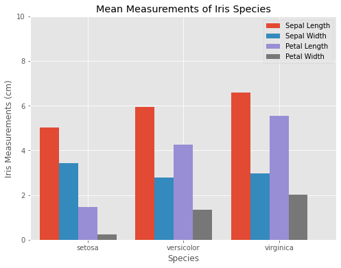

.. image:: visualization_files/visualization_20_2.png

.. code:: ipython3

    import matplotlib
    matplotlib.use('Agg')
    import matplotlib.pyplot as plt
    import numpy as np
    import matplotlib.gridspec as gridspec
    #Write your code here
    
    def test_generate_figure1():
    
        t = np.arange(0.0,5.0,0.01)
        s1 = np.sin(2*np.pi*t)
        s2 = np.sin(4*np.pi*t)
    
        fig = plt.figure(figsize=(8,6))
    
        axes1 = plt.subplot(2,1,1,title="Sin(2*pi*x)")
        axes1.plot(t,s1)
    
        axes2 = plt.subplot(2,1,2,title="Sin(4*pi*x)",sharex=axes1, sharey=axes1)
        axes2.plot(t,s2)
    
        plt.savefig("./testfigure1.png")
    
    test_generate_figure1()
    
    
    def test_generate_figure2():
    
        np.random.seed(1000)
    
        x = np.random.rand(10)
        y= np.random.rand(10)
        z= np.sqrt(x**2 + y**2)
    
        fig = plt.figure(figsize=(8,6))
    
        axes1 = plt.subplot(2,2,1,title="Scatter plot with Upper Triangle Markers")
        axes1.scatter(x,y,s=80,c=z,marker="^")
        axes1.set_xticks([0.0,0.4,0.8,1.2])
        axes1.set_yticks([-0.2,0.2,0.6,1.0])
    
        axes2 = plt.subplot(2,2,2,title="Scatter plot with Plus Markers")
        axes2.scatter(x,y,s=80,c=z,marker="+")
        axes2.set_xticks([0.0,0.4,0.8,1.2])
        axes2.set_yticks([-0.2,0.2,0.6,1.0])
    
        axes3 = plt.subplot(2,2,3,title="Scatter plot with Circle Markers")
        axes3.scatter(x,y,s=80,c=z,marker="o")
        axes3.set_xticks([0.0,0.4,0.8,1.2])
        axes3.set_yticks([-0.2,0.2,0.6,1.0])
    
        axes4 = plt.subplot(2,2,4,title="Scatter plot with Diamond Markers")
        axes4.scatter(x,y,s=80,c=z,marker="d")
        axes4.set_xticks([0.0,0.4,0.8,1.2])
        axes4.set_yticks([-0.2,0.2,0.6,1.0])
    
        plt.tight_layout()
        plt.savefig("./testfigure2.png")
    
    test_generate_figure2()
    
    
    def test_generate_figure3():
        x= np.arange(1,101)
        y1 = x
        y2 = x**2
        y3 = x**3
    
        fig = plt.figure(figsize=(8,6))
        g = gridspec.GridSpec(2,2)
    
        axes1 = plt.subplot(g[0,0],title="y = x")
        axes1.plot(x,y1)
    
        axes2 = plt.subplot(g[1,0],title="y = x**2")
        axes2.plot(x,y2)
    
        axes3 = plt.subplot(g[:,1],title="y = x**3")
        axes3.plot(x,y3)
    
        plt.tight_layout()
        plt.savefig("./testfigure3.png")
    
    test_generate_figure3()
    
    
    

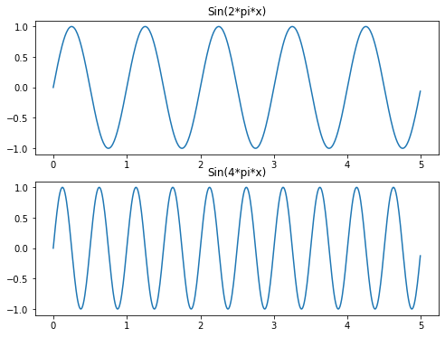

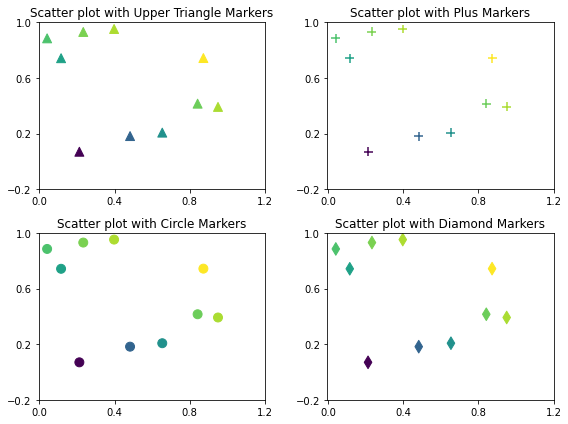

